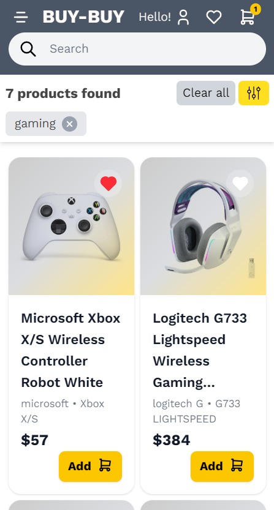

# 🛒 Buy-Buy

Buy-Buy is a modern _e-commerce web application_ built with _Next.js, React, Tailwind CSS, and TypeScript_.  
It provides a smooth shopping experience with features such as product browsing, cart management, wishlist, and authentication.

---

## ✨ Features

- 🛍 Browse a catalog of products
- 🔍 Search and filter products
- ❤ Add products to wishlist
- 🛒 Add products to cart with quantity control
- 👤 User authentication (Firebase)
- 📦 Place and review orders
- 🌙 Modern responsive design with Tailwind CSS
- 🚀 Deployed with Vercel & GitHub Actions (CI/CD)

---

## 🖼 Screenshots

<!-- 
 -->

[<img src="./public/market-page-screenshot.png" width="350"]

---

## 🛠 Tech Stack

- _Framework_: [Next.js](https://nextjs.org/)
- _Language_: [TypeScript](https://www.typescriptlang.org/)
- _UI_: [React](https://react.dev/) + [Tailwind CSS](https://tailwindcss.com/)
- _Auth_: [Firebase Authentication](https://firebase.google.com/)
- _Deployment_: [Vercel](https://vercel.com/)
- _Testing_: [Cypress](https://www.cypress.io/)

---

## 📦 Deployment

This project uses Vercel for hosting.
Every push to the main branch triggers a new deployment automatically via CI/CD.

## 👨‍💻 Author

Developed by Jose (VigoDev) 🚀
Frontend developer passionate about building modern, performant, and user-friendly applications.

🔗 [Portfolio](https://josevigodev.github.io/personal-portfolio-web/) · [LinkedIn](https://www.linkedin.com/in/josevigodev/)
